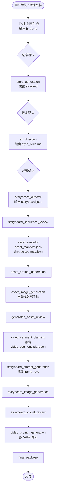
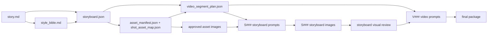

# AI 视频智能生产系统 — 正式流程图

> 版本：v3.1  
> 更新日期：2026-08-01  
> 目标：让流程说明与 `scripts/pipeline_runtime.py`、阶段 Skill 和质量门保持一致。

## 0. 解释优先级

本文件是流程说明，不是状态机本身。出现不一致时，按以下顺序判断：

1. `scripts/pipeline_runtime.py` 的 `STAGES`
2. 当前阶段 Skill 的 Inputs / Outputs / Quality Gate
3. `scripts/stage_gate.py` 与 `scripts/validate_project.py`
4. 本流程图、README 和其他说明文档

任何下游阶段都不得仅凭文档描述绕过上游门禁。

---

## 1. 整体流程

创意简报属于受控状态机之前的前置创意步骤。正式状态机从剧本生成开始。



### 不可颠倒的核心顺序

```text
generated_asset_review
→ video_segment_planning
→ storyboard_prompt_generation
→ storyboard_image_generation
→ storyboard_visual_review
→ video_prompt_generation
```

原因：分镜提示词必须知道当前 `S###` 在视频段中的实际帧角色。`first_frame`、`last_frame` 和 `keyframe` 由 `video_segment_plan.json` 决定，分镜提示词生成器不得自行猜测。

---

## 2. 正式状态机阶段

当前 `pipeline_runtime.py` 的阶段顺序是：

| 顺序 | stage | 主要输出 | 是否需要人工批准 |
|---:|---|---|---|
| 1 | `story_generation` | `outputs/story.md` | 是 |
| 2 | `art_direction` | `outputs/style_bible.md` | 是 |
| 3 | `storyboard_director` | `outputs/storyboard.json` | 否 |
| 4 | `storyboard_sequence_review` | `outputs/reviews/storyboard_sequence_review.json` | 是 |
| 5 | `asset_executor` | `asset_manifest.json`、`shot_asset_map.json` | 否 |
| 6 | `asset_prompt_generation` | 人物/场景/道具提示词 | 否 |
| 7 | `asset_image_generation` | 资产图片及生成队列结果 | 否 |
| 8 | `generated_asset_review` | 已批准资产与审核报告 | 是 |
| 9 | `video_segment_planning` | `outputs/video_segment_plan.json` | 否 |
| 10 | `storyboard_prompt_generation` | `outputs/approved/storyboard_prompts/S###.md` | 否 |
| 11 | `storyboard_image_generation` | `outputs/storyboards/S###.png` | 否 |
| 12 | `storyboard_visual_review` | `outputs/reviews/storyboard_visual_review.json` | 是 |
| 13 | `video_prompt_generation` | `outputs/approved/video_generation/V###/` | 否 |
| 14 | `final_package` | `outputs/final_package_manifest.json` | 否 |

---

## 3. 阶段详解

### 3.1 创意前置步骤

**Skill**：`advertising-idea-strategy`

**输入**：用户想法、产品资料、品牌资料、活动规则、平台与时长要求。

**输出**：`outputs/brief.md`

创意简报决定“拍什么”，不写完整剧本、分镜、资产或生成提示词。当前该步骤尚未进入 `pipeline_runtime.py` 的受控 `STAGES`，因此必须在进入 `story_generation` 前人工确认。

### 3.2 剧本生成

**输入**：已确认的 `brief.md`

**输出**：`story.md`

广告项目的 `story.md` 必须包含 `## 商业信息`，记录品牌、产品、核心信息、CTA、证据和合规边界。剧本阶段不写镜头字段和资产清单。

### 3.3 艺术方向

**输入**：已确认的 `story.md`

**输出**：`style_bible.md`

只定义画面风格、整体色调、光线和 AI 视觉执行规则。具体构图、景别、机位和调度由分镜导演负责。

### 3.4 分镜导演与顺序审核

**输入**：`story.md`、`style_bible.md`

**输出**：`storyboard.json`

每个镜头包含：

- `shot_id`
- `scene_id`
- `duration_seconds`
- `framing`
- `camera_move`
- `action_desc`
- 垂类扩展字段，如对白、旁白和配乐

单个 `S###` 的时长上限与视频段上限不是同一个概念。当前质量门要求单镜头不超过 15 秒；视频段总时长由垂类的 `max_generated_clip_seconds` 控制。

`storyboard_sequence_review` 在资产生产前检查：

- 叙事顺序是否成立
- Hook、产品、CTA 节奏是否完整
- `scene_id` 是否合理
- 单镜头时长与总时长是否有效
- 动作是否足够具体、可被静态分镜和视频生成表达

### 3.5 资产执行与资产审核

`asset_executor` 输出：

- `asset_manifest.json`
- `shot_asset_map.json`

人物、场景和关键道具提示词可以并行生产。只出现一次的普通道具通常不拆为独立资产。

自动生图 Provider 是可选的；资产图片本身不是可选的。也就是说，可以自动生成，也可以外部手动生成后登记，但进入 `generated_asset_review` 和后续图片依赖阶段前，必须存在有效图片。

### 3.6 视频段规划

**Skill**：`video_segment_planner`

**输入**：

- `storyboard.json`
- `shot_asset_map.json`
- 垂类配置中的 `max_generated_clip_seconds`

**输出**：`video_segment_plan.json`

规划规则：

1. 初始状态为一个镜头一个视频段。
2. 只考虑下一个连续镜头。
3. 只允许合并相同 `scene_id` 的镜头。
4. 只有动作阶段、屏幕方向、站位关系或单一运镜真正连续时才合并。
5. 合并总时长不得超过垂类配置。
6. 场景切换、时间跳跃、主体或视点发生真实切换时必须拆分。
7. 每个 storyboard shot 必须被且仅被一个视频段覆盖，并保持原顺序。

示例：

```json
{
  "video_id": "V001",
  "source_shots": ["S001", "S002", "S003"],
  "scene_id": "SC001",
  "duration_seconds": 12,
  "merge_strategy": "continuous_action",
  "merge_reason": "同一场景内人物起身、走向门口并离开，动作和站位连续。",
  "frame_plan": [
    {"shot_id": "S001", "role": "first_frame"},
    {"shot_id": "S002", "role": "keyframe"},
    {"shot_id": "S003", "role": "last_frame"}
  ]
}
```

单镜头视频段只使用 `first_frame`。多镜头视频段的首尾分别是 `first_frame` 和 `last_frame`，中间确有控制价值的镜头是 `keyframe`。

### 3.7 分镜提示词与分镜图

**Skill**：`storyboard_prompt_generator`

**输入**：

- `storyboard.json`
- `style_bible.md`
- `shot_asset_map.json`
- `video_segment_plan.json`
- 已批准资产图片
- 必要时的上一分镜图片

每次只处理一个 `S###`。必须完成两项判断：

1. 从 `video_segment_plan.json` 读取当前镜头的 `frame_role`。
2. 判断是否引用上一分镜作为站位锚点。

上一分镜只能用于人物相对位置、朝向、空间比例和场景连续性，不强制复制动作、表情、光线和景别。不得跨 `scene_id` 引用。

正式图片按镜头保存：

```text
outputs/storyboards/S001.png
outputs/storyboards/S002.png
outputs/storyboards/S003.png
```

### 3.8 “分镜板”的正式含义

一个视频段的分镜板由该段 source shots 对应的逐镜图片共同组成：

```text
V001
├── S001.png  first_frame
├── S002.png  keyframe
└── S003.png  last_frame
```

为了人工审核，可以额外生成：

```text
outputs/review_boards/V001_storyboard_board.png
```

该联系表只是展示件。正式数据源仍然是：

- `video_segment_plan.json`
- 每个 `S###` 的分镜提示词
- 每个 `S###` 的独立分镜图片

### 3.9 分镜视觉审核

在视频提示词生产前检查：

- 人物是否变脸、变体是否错误
- 场景空间、轴线和主要道具是否跳位
- 小型连续动作是否能从首帧自然推进到尾帧
- 产品包装、Logo 和品牌色是否准确
- 帧角色是否与 `video_segment_plan.json` 一致
- 上一分镜锚点是否只用于站位连续性

存在未解决 P0 时不得进入视频提示词阶段。

### 3.10 视频提示词

**Skill**：`video_prompt_generator`

按 `V###` 循环生成，每次只处理一个已规划的视频段。该阶段不得重新合并、拆分或修改帧角色。

主要输入：

- `video_segment_plan.json`
- `storyboard.json`
- `shot_asset_map.json`
- source shots 对应的分镜提示词
- source shots 对应的分镜图片
- 已批准资产参考图

每个视频段只使用一种主运镜。提示词重点描述从首帧到尾帧的画面演进，不重复已经被参考图锁定的静态构图与人物外形。

---

## 4. 产物依赖关系



---

## 5. 图片执行的“可选”边界

“生图可选”只表示自动执行方式可选：

- 可以使用仓库图片队列和 Provider。
- 可以在外部工具手动生成，再通过登记脚本回填。
- 可以复用用户提供且通过审核的正式参考图。

它不表示可以在需要视觉控制的生产链中完全没有图片。如果选择继续执行 `storyboard_prompt_generation`、`storyboard_image_generation`、`storyboard_visual_review` 和正式视频提示词生产，则必须满足相应图片和审核门禁。

---

## 6. 时长规则

- 单个 storyboard shot：当前质量门上限为 15 秒。
- 单个生成视频段：读取垂类配置的 `production.max_generated_clip_seconds`。
- 广告垂类当前配置值为 30 秒。
- Schema、验证器和文档必须与垂类配置保持一致；不得在多个位置分别维护相互冲突的硬编码上限。

---

## 7. 常用命令

```bash
python scripts/run_pipeline.py RUN_DIR status
python scripts/run_pipeline.py RUN_DIR start --stage video_segment_planning
python scripts/run_pipeline.py RUN_DIR complete --stage video_segment_planning
python scripts/validate_project.py RUN_DIR --phase video_segment_plan
python scripts/run_pipeline.py RUN_DIR start --stage storyboard_prompt_generation
python scripts/validate_project.py RUN_DIR --level production
```

---

## 8. 防止再次漂移的检查清单

修改流程、阶段顺序或输入契约时，应同步检查：

- [ ] `scripts/pipeline_runtime.py`
- [ ] `checkpoint.template.json`
- [ ] `scripts/stage_gate.py`
- [ ] `scripts/validate_project.py`
- [ ] 对应 Skill 的 Inputs / Outputs / Quality Gate
- [ ] `README.md`
- [ ] `PIPELINE_FLOW.md`
- [ ] 相关 Schema 和垂类配置

特别检查：

- [ ] `video_segment_planning` 是否位于 `storyboard_prompt_generation` 之前
- [ ] 分镜提示词是否强制读取 `video_segment_plan.json`
- [ ] 视频段帧角色是否唯一且覆盖所有 source shots
- [ ] 自动生图可选与正式图片产物必需是否被正确区分
- [ ] 时长上限是否来自统一配置，而不是互相冲突的硬编码
