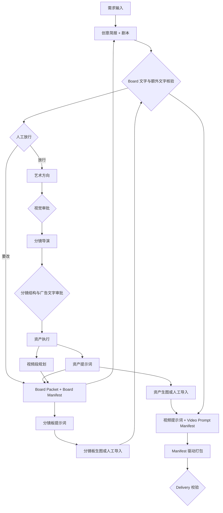

# AI 广告视频前期生产流程

> 版本：v8.0

## DAG

## 创意审查回环

`idea_generation` 产出 `brief.md` + `story.md` 后、人工审批前，运行 `advertising-idea-review` 自动审查：对话中输出八维诊断报告，并把问题清单写入 `outputs/idea_review_feedback.md`。

- 审查**只出意见、不放行**；放行权始终在人工（`approve` / `reject`）。
- `reject` 后进入修订轮：`advertising-idea-strategy` 自动读取反馈文件逐条修订，产出新 revision。
- 修订后**不自动二次审查**，除非人工明确要求（此时审查轮次 +1）。
- `outputs/idea_review_feedback.md` 是流程状态，不进 Artifact/Approval Registry、不进最终包、不参与校验。

## 状态与数据职责

| 层 | 事实源 | 职责 |
|---|---|---|
| 流程 | `config/pipeline.yaml` | DAG、executor、审批、skip、输出 |
| 执行 | `checkpoint.json` + tasks | 阶段和任务状态 |
| 产物 | `artifact_registry.json` | revision、path、hash、依赖 |
| 审批 | `approval_registry.json` | 谁批准了哪个 revision/hash |
| 镜头关系 | Board/Video Manifest | V、SB、S 和媒体引用 |
| 交付 | `final_package_manifest.json` | 包文件、hash、blocker |

## Skip 规则

图片执行器可被人工导入替代，但媒体产物不是无条件可缺失。`skip_effect=draft_only` 只允许继续生成内部草稿；production 必须有已登记、已批准的必需资产图和分镜板图。

## V8 视频生成规则

- 每个 `V###` 为 4–30 秒；原子 `S###` 可以更短，但只能在同一场景内合并。
- 未声明画幅时使用 `16:9`。
- 场景、构图、装饰、静态特效和广告文字在 Board 阶段固定。
- 视频模型只接收 Board、人物和广告商品参考。

## 回退规则

批准后的 canonical artifact 发生 hash 变化时，当前 approval 失效，依赖该 revision 的所有下游进入 `invalidated`。修改必须生成新 revision，禁止覆盖已批准快照。
