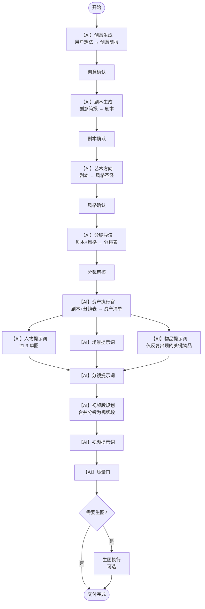
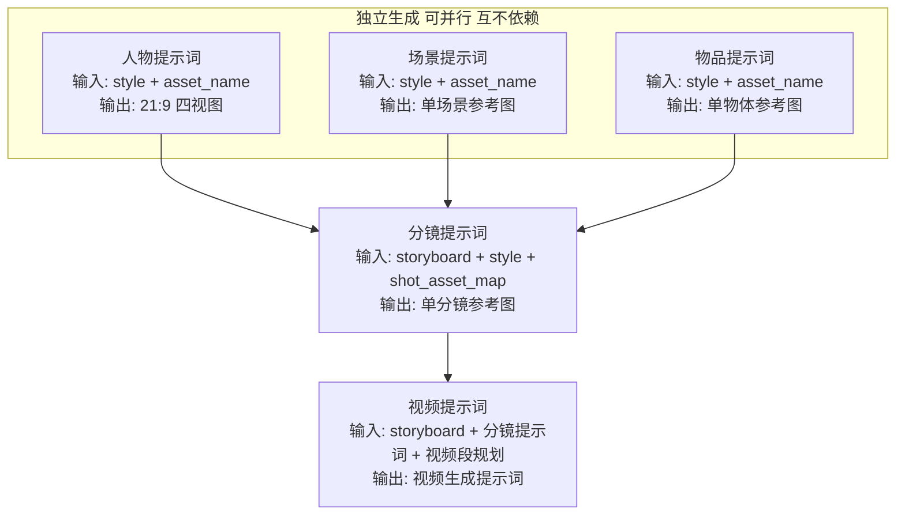

# AI 视频智能生产系统 — 完整流程图

> 版本：v3.0  日期：2026-07-29
> 原则：一个项目对应一种垂类；默认策略层全部去掉，只做广告；每个步骤最小且必要输入

---

## 一、整体流程总览

**关键变更：**
- 去掉 vertical 选择环节（一项目一垂类）
- 去掉环节0（创意输入直接进创意生成）
- 去掉默认 Skill（idea_generation / story_generation / art_direction 默认版全部删除）
- 人物/场景/物品三路并行，互不依赖
- 人物提示词改为 21:9 单图（面部特写+正/侧/后视图）
- 物品资产只保留反复出现的关键物品

---

## 二、环节详解：输入 / 输出 / AI标注

### 阶段一：创意与剧本

#### 环节 1：【AI】创意生成
- **类型**：AI 策略层
- **Skill**：`advertising-idea-strategy`
- **输入**：
  - 用户想法（直接对话或文档）
    - 中文解释：用户的一句话想法、一个产品介绍、或一场广告比赛活动说明
  - 用户补充资料（产品资料、品牌资料、参考视频等，可选）
- **输出**：`brief.md`（创意简报）
  - 中文解释：结构化创意简报，包含核心创意、主角设定、核心冲突、情绪方向、目标受众、目标平台、画幅比例、目标时长、商业元素（产品/卖点/CTA/证据）、禁用元素、参考
- **AI 提示词位置**：`.agents/skills/advertising-idea-strategy/SKILL.md`
- **优化重点**：决定"拍什么"，不写具体剧本

---

#### 环节 2：创意确认
- **类型**：人工审核
- **输入**：`brief.md`（创意简报）
- **输出**：approved `brief.md`（已确认的创意简报）
- **备注**：用户确认创意方向后才能进入剧本阶段

---

#### 环节 3：【AI】剧本生成
- **类型**：AI 策略层
- **Skill**：`advertising-content-strategy`
- **输入**：
  - approved `brief.md`（已确认创意简报）
    - 中文解释：创意方向，包含核心创意、主角、冲突、商业元素
- **输出**：`story.md`（剧本）
  - 中文解释：完整剧本，包含故事内容、人物对白、场景描述、动作推进。广告类型还包含 `## 商业信息` 章节（产品、卖点、CTA、证据）
- **AI 提示词位置**：`.agents/skills/advertising-content-strategy/SKILL.md`
- **优化重点**：决定"怎么拍"，不写镜头和提示词

---

#### 环节 4：剧本确认
- **类型**：人工审核
- **输入**：`story.md`（剧本）
- **输出**：approved `story.md`（已确认的剧本）

---

### 阶段二：视觉与分镜

#### 环节 5：【AI】艺术方向
- **类型**：AI 策略层
- **Skill**：`advertising-art-direction`
- **输入**：
  - approved `story.md`（已确认剧本）
    - 中文解释：完整剧本
- **输出**：`style_bible.md`（风格圣经）
  - 中文解释：视觉风格指南，定义全片色调、材质、光线、构图方向、角色视觉风格、场景视觉风格
- **AI 提示词位置**：`.agents/skills/advertising-art-direction/SKILL.md`
- **优化重点**：统一全片视觉方向

---

#### 环节 6：风格确认
- **类型**：人工审核
- **输入**：`style_bible.md`（风格圣经）
- **输出**：approved `style_bible.md`（已确认风格圣经）

---

#### 环节 7：【AI】分镜导演
- **类型**：AI 策略层
- **Skill**：`advertising-storyboard-strategy`
- **输入**：
  - approved `story.md`（已确认剧本）
  - approved `style_bible.md`（已确认风格圣经）
- **输出**：`storyboard.json`（分镜表）
  - 中文解释：结构化分镜表，每个分镜包含：
    - `shot_id`（分镜编号）
    - `scene_id`（场景编号）
    - `duration_seconds`（时长秒数，单镜头≤15秒）
    - `framing`（景别）
    - `camera_move`（运镜方式）
    - `action_desc`（动作描述）
    - `dialogue`（台词）— 人物对白
    - `voiceover`（配音）— 旁白/画外音
    - `music`（配乐）— 背景音乐描述
- **AI 提示词位置**：`.agents/skills/advertising-storyboard-strategy/SKILL.md`、`skills/raw_prompts/storyboard_director.source.md`
- **优化重点**：每个镜头怎么拍，含动作+台词+配音+配乐

---

#### 环节 8：分镜审核
- **类型**：质量门检查
- **输入**：`storyboard.json`（分镜表）
- **输出**：通过 / 退回修改

---

### 阶段三：资产固定

#### 环节 9：【AI】资产执行官
- **类型**：AI 基础设施层（共用）
- **Skill**：`asset_executor`
- **输入**：
  - `story.md`（剧本）
  - `storyboard.json`（分镜表）
- **输出**：
  - `asset_manifest.json`（资产清单）
    - 中文解释：所有需要生成的资产列表，包含人物资产、场景资产、物品资产
    - **物品资产只包含反复出现的关键物品**：必须在 2 个及以上分镜出现，且对剧情有推进作用。只出现一次的道具不作为独立资产，在分镜提示词中用文字描述即可
    - 物品资产额外标记 `is_key_item: true`（全部为 true，因为只保留反复出现的）、`recurrence_count`（出现次数）、`appearances`（出现分镜列表）
  - `shot_asset_map.json`（分镜资产映射）
    - 中文解释：每个分镜用到了哪些资产，映射关系表
- **AI 提示词位置**：`skills/asset_executor.md`
- **优化重点**：固定资产最小单位，物品只保留反复出现的

---

### 阶段四：三类提示词生产（并行，互不依赖）

#### 环节 10：【AI】人物提示词
- **类型**：AI 基础设施层（共用）
- **Skill**：`character_prompt_generator`
- **输入**：
  - `style_bible.md`（风格圣经）— 视觉方向
  - `asset_name`（资产名，如"林小满_雨夜居家装"）
- **输出**：`outputs/assets/characters/prompts/{asset_name}.md`（人物提示词文件）
  - 中文解释：21:9 宽幅单图参考提示词，横向排列展示：
    - 面部特写
    - 正视图
    - 侧视图
    - 后视图
  - 四视图保持同一身份、年龄、发型、体型和服装
- **AI 提示词位置**：`skills/raw_prompts/character_prompt_generator.source.md`
- **优化重点**：人物外观一致性锁定，21:9 四视图

---

#### 环节 11：【AI】场景提示词
- **类型**：AI 基础设施层（共用）
- **Skill**：`scene_prompt_generator`
- **输入**：
  - `style_bible.md`（风格圣经）— 视觉方向
  - `asset_name`（资产名，如"雨夜客厅场景"）
- **输出**：`outputs/assets/scenes/prompts/{asset_name}.md`（场景提示词文件）
  - 中文解释：单场景参考图提示词，用于生成场景空间参考图
- **AI 提示词位置**：`skills/raw_prompts/scene_prompt_generator.source.md`
- **优化重点**：场景空间一致性

---

#### 环节 12：【AI】物品提示词
- **类型**：AI 基础设施层（共用）
- **Skill**：`prop_prompt_generator`
- **输入**：
  - `style_bible.md`（风格圣经）— 视觉方向
  - `asset_name`（资产名，如"信件"）
- **输出**：`outputs/assets/props/prompts/{asset_name}.md`（物品提示词文件）
  - 中文解释：单物体参考图提示词。所有进入此环节的物品都是反复出现的关键物品，必须强调外观一致性锁定，说明固定特征（形状、材质、颜色、尺寸、特殊标记、磨损位置等）
- **AI 提示词位置**：`skills/raw_prompts/prop_prompt_generator.source.md`
- **优化重点**：关键物品一致性锁定，最小输入

---

### 阶段五：分镜提示词

#### 环节 13：【AI】分镜提示词
- **类型**：AI 策略层
- **Skill**：`advertising-prompt-strategy`
- **输入**：
  - `storyboard.json`（分镜表）— 分镜信息（含台词/配音/配乐）
  - `style_bible.md`（风格圣经）— 视觉方向
  - `shot_asset_map.json`（分镜资产映射）— 本分镜用到哪些人物/场景/物品
- **输出**：`outputs/storyboard_prompts/{shot_id}.md`（分镜提示词文件）
  - 中文解释：每个分镜的参考图提示词。包含：
    - 帧角色（首帧/尾帧/关键帧）
    - 上一分镜站位参考判断
    - 显式资产引用区（列出引用的人物/场景/物品+出现次数）
    - 中文分镜图提示词
- **AI 提示词位置**：`.agents/skills/advertising-prompt-strategy/SKILL.md`、`skills/raw_prompts/storyboard_prompt_generator.source.md`
- **优化重点**：分镜引用人物+场景+物品

---

### 阶段六：视频提示词

#### 环节 14：【AI】视频段规划
- **类型**：AI 基础设施层（共用）
- **Skill**：`video_segment_planner`
- **输入**：
  - `storyboard.json`（分镜表）
  - `shot_asset_map.json`（分镜资产映射）
  - `max_generated_clip_seconds`（镜头组上限秒数，从 vertical 配置注入，广告=30秒）
- **输出**：`video_segment_plan.json`（视频段规划）
  - 中文解释：将连续分镜合并为视频段（V###），每个视频段包含 source_shots（源分镜列表）、duration_seconds（总时长，≤30秒）、merge_decision（合并决策）
- **AI 提示词位置**：`skills/video_segment_planner.md`
- **优化重点**：合并规则（同场景、动作连续、≤30秒）

---

#### 环节 15：【AI】视频提示词
- **类型**：AI 基础设施层（共用）
- **Skill**：`video_prompt_generator`
- **输入**：
  - `storyboard.json`（分镜表）
  - `video_segment_plan.json`（视频段规划）
  - `outputs/storyboard_prompts/*.md`（分镜提示词）
  - `max_generated_clip_seconds`（镜头组上限，广告=30秒）
- **输出**：
  - `video_prompts.md`（视频提示词文档）
    - 中文解释：每个视频段（V###）的最终生成提示词，包含资产声明区、frame_references（帧引用）、merge_decision（合并决策）、中文视频提示词正文
  - `video_prompts.json`（视频提示词结构化数据）
    - 中文解释：机器可读的视频提示词，供下游视频生成工具使用
- **AI 提示词位置**：`skills/raw_prompts/seedance_video_prompt.source.md`、`skills/video_prompt_generator.md`
- **优化重点**：引用分镜+人物，锁补匹配、运镜纯度

---

### 阶段七：质量检查与交付

#### 环节 16：【AI】质量门
- **类型**：AI 策略层
- **Skill**：`advertising-quality-gate`
- **输入**：
  - `story.md`（剧本）
  - `style_bible.md`（风格圣经）
  - `storyboard.json`（分镜表）
  - 所有提示词产出
- **输出**：`vertical_review.json`（质量检查报告）
  - 中文解释：按广告标准检查质量，检查广告合规、CTA、证据
- **AI 提示词位置**：`.agents/skills/advertising-quality-gate/SKILL.md`

---

#### 环节 17：生图执行（可选）
- **类型**：可选执行，支持手动或自动
- **输入**：各类提示词（人物/场景/物品/分镜）
- **输出**：图片文件（.png）
- **备注**：可跳过，提示词产出后即可交付。支持手动上传图片后用 `register_image_result.py` 回填

---

## 三、AI 环节汇总（提示词优化清单）

| # | AI 环节 | 策略层/基础设施层 | 提示词文件位置 | 优化重点 |
|---|---|---|---|---|
| 1 | 创意生成 | 策略层 | `.agents/skills/advertising-idea-strategy/SKILL.md` | 决定"拍什么" |
| 2 | 剧本生成 | 策略层 | `.agents/skills/advertising-content-strategy/SKILL.md` | 决定"怎么拍" |
| 3 | 艺术方向 | 策略层 | `.agents/skills/advertising-art-direction/SKILL.md` | 统一视觉方向 |
| 4 | 分镜导演 | 策略层 | `.agents/skills/advertising-storyboard-strategy/SKILL.md` | 每个镜头怎么拍（含台词/配音/配乐） |
| 5 | 资产执行官 | 基础设施层 | `skills/asset_executor.md` | 固定资产最小单位，物品只保留反复出现的 |
| 6 | 人物提示词 | 基础设施层 | `skills/raw_prompts/character_prompt_generator.source.md` | 21:9 四视图（面部特写+正/侧/后视图） |
| 7 | 场景提示词 | 基础设施层 | `skills/raw_prompts/scene_prompt_generator.source.md` | 场景空间一致性 |
| 8 | 物品提示词 | 基础设施层 | `skills/raw_prompts/prop_prompt_generator.source.md` | 关键物品一致性锁定，最小输入 |
| 9 | 分镜提示词 | 策略层 | `.agents/skills/advertising-prompt-strategy/SKILL.md` | 引用人物+场景+物品 |
| 10 | 视频段规划 | 基础设施层 | `skills/video_segment_planner.md` | 合并规则（≤30秒） |
| 11 | 视频提示词 | 基础设施层 | `skills/raw_prompts/seedance_video_prompt.source.md` | 引用分镜+人物 |
| 12 | 质量门 | 策略层 | `.agents/skills/advertising-quality-gate/SKILL.md` | 广告质量标准 |

---

## 四、五类提示词引用关系

| 提示词类型 | 输入 | 输出 | 引用关系 |
|---|---|---|---|
| 人物提示词 | `style_bible.md` + `asset_name` | 21:9 四视图（面部特写+正/侧/后视图） | 独立 |
| 场景提示词 | `style_bible.md` + `asset_name` | 单场景参考图提示词 | 独立 |
| 物品提示词 | `style_bible.md` + `asset_name` | 单物体参考图提示词 | 独立 |
| 分镜提示词 | `storyboard.json` + `style_bible.md` + `shot_asset_map.json` | 单分镜参考图提示词 | 引用人物+场景+物品 |
| 视频提示词 | `storyboard.json` + `video_segment_plan.json` + 分镜提示词 | 视频生成提示词 | 引用分镜+人物 |

---

## 五、与上一版的关键变更

| # | 变更项 | 上一版 | 本版 |
|---|---|---|---|
| 1 | vertical 选择 | 有选择环节 | 去掉，一项目一垂类 |
| 2 | 环节0 创意输入 | 单独环节填写 idea_brief.md | 去掉，直接进创意生成 |
| 3 | 默认 Skill | 有 idea_generation/story_generation/art_direction 默认版 | 全部删除，只保留广告策略 |
| 4 | 分镜导演字段 | 只有 action_desc | 增加 dialogue（台词）、voiceover（配音）、music（配乐） |
| 5 | 物品资产定义 | in_场景内反复出现的 | 只保留反复出现的（≥2次），一次性道具不作为独立资产 |
| 6 | 人物提示词格式 | 2x2 四宫格 | 21:9 宽幅单图（面部特写+正/侧/后视图） |
| 7 | 物品提示词输入 | story + style + asset_name + is_key_item + recurrence_count + appearances | 精简为 style + asset_name |
| 8 | 三类提示词关系 | 人物提示词与其他有关联 | 完全并行，互不依赖 |
